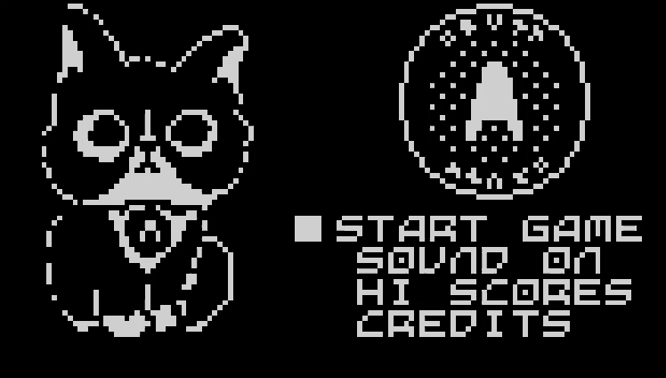

# Ozzy the Cat

Move the cat to catch as many OAuth tokens as you can in 2 minutes

[View on YouTube](https://youtu.be/zFncT_siSMI)

## Changelog

**0.04**

* Replaced graphics with OAuth tokens and Ozzy the cat
* Press RIGHT 10 times on the high score list to reset EEPROM
* When game is paused, press DOWN to immediately abort the game
* Adds additional horizontal movement to prevent being able to send tokens straight up, which previously made it easy to keep them all at a wall.
* Remove walls when there are more than 16 tokens, and bring them back when there are fewer than 12.
* In "turbo token" mode, tokens move quicker both horizontally and vertically

## Credits

Original gameplay by [OBONO](https://github.com/obono/ArduboyWorks/tree/master/chribocchi), with minor changes by [Aaron Parecki](https://aaronparecki.com)

Original cat artwork by [Fiona W](https://www.instagram.com/aliasxahna/), 1-bit pixel version by [Aaron Parecki](https://aaronparecki.com)
